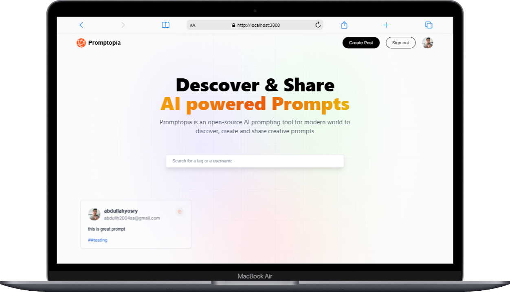
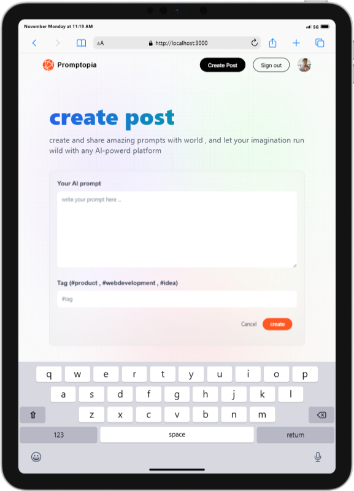
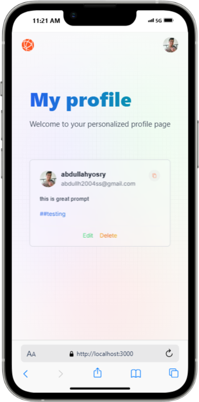

# Promotopia - Full Stack Web Application

Promotopia is a full-stack web application built with **Next.js**, **MongoDB**, and **Tailwind CSS**. It allows users to create, share, and manage AI prompts for various use cases. The platform integrates **Google Authentication** for secure login and offers a seamless user experience.

## Features
- **User Authentication**: Secure login using Google OAuth.
- **CRUD Functionality**: Create, Read, Update, and Delete prompts.
- **Responsive Design**: Fully responsive design using **Tailwind CSS**.
- **SEO Optimization**: Implemented **Server-Side Rendering (SSR)** and **Static Site Generation (SSG)**.
- **Real-Time Data Management**: Data is managed with **MongoDB** and **Mongoose**.
- **RESTful API**: Efficient data retrieval with REST API.

## Demo
Here’s a quick demo of what the application looks like:







## Technologies Used
- **Next.js** - React framework for building the user interface and handling routing.
- **MongoDB** - NoSQL database for storing user data and prompts.
- **Tailwind CSS** - Utility-first CSS framework for styling the UI.
- **Google Authentication** - OAuth-based login for secure authentication.
- **Mongoose** - ODM for MongoDB for managing data in a structured manner.
- **Vercel** - Deployment platform used for hosting the application.

## Setup

### Prerequisites
Make sure you have the following installed:
- Node.js (version 14 or above)
- MongoDB (or use MongoDB Atlas for cloud-based DB)
- Git

### Clone the Repository
To clone the repository, run:

```bash
git clone https://github.com/your-username/promotopia.git
